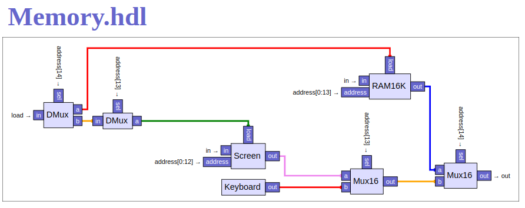
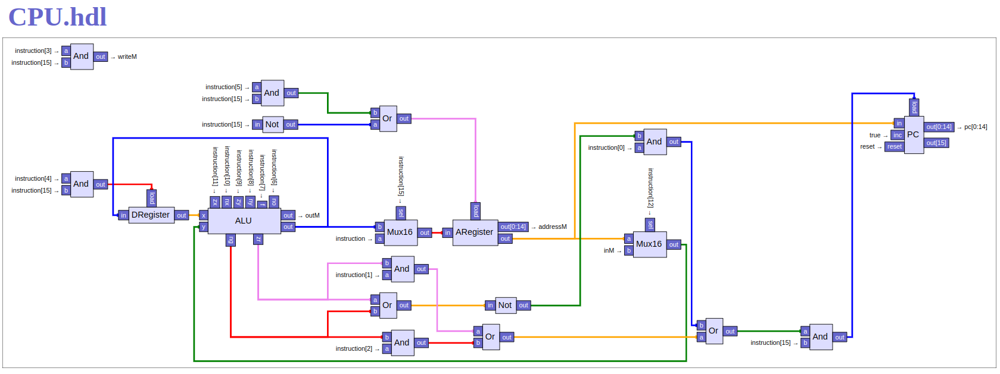

# Complete the construction of the Hack CPU and the Hack hardware platform, leading up to the top-most Computer chip.

## Memory.hdl - Entire RAM address space

## CPU.hdl - The Hack CPU

## Computer.hdl - The platform'stop-most chip

